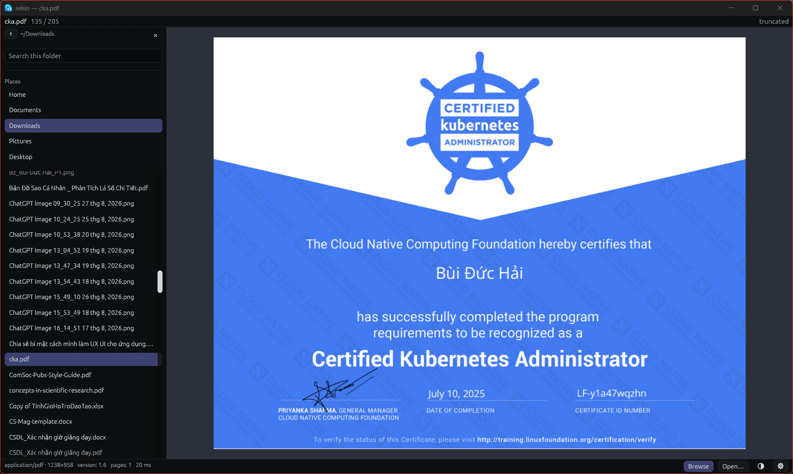
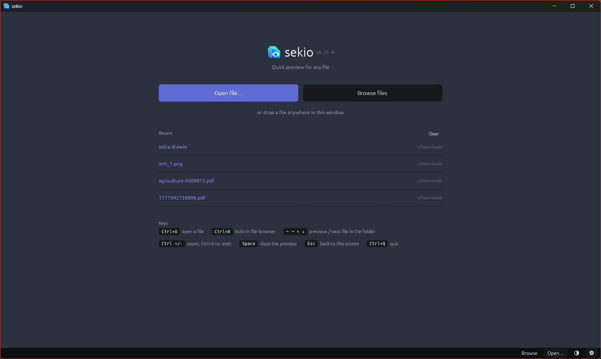
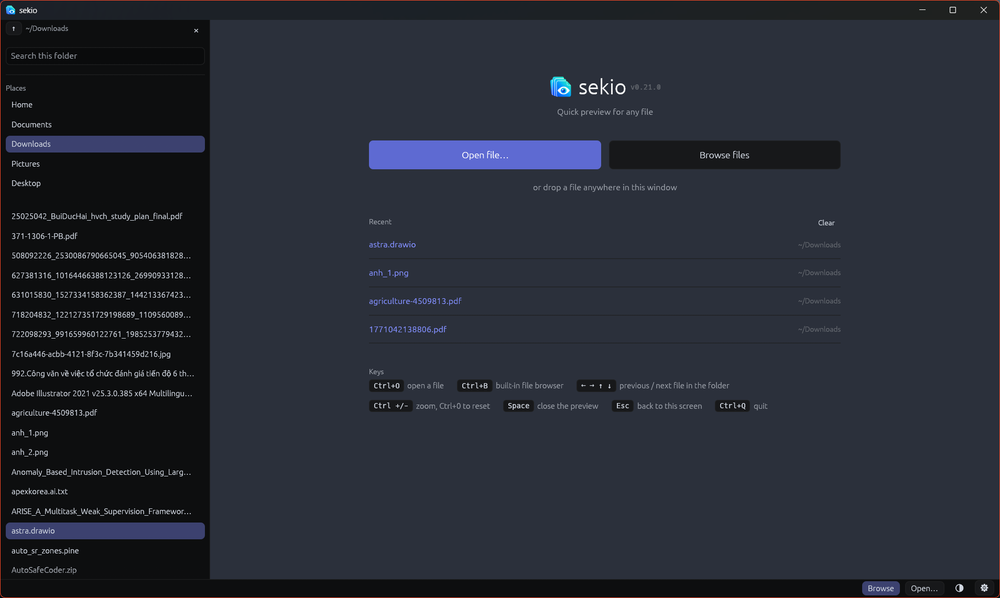

<div align="center">


# sekio

**Quick-view for any filetype.** A terminal command, a two-pane file browser,
and a Quick Look-style popup — all sharing one engine.

[](https://github.com/hairbui76/sekio/releases/latest)
[](https://github.com/hairbui76/sekio/actions/workflows/ci.yml)
[](LICENSE-MIT)
[](#install)

</div>



---

## Why

Opening a heavyweight application just to remember what a file *is* wastes more
time than it should. sekio answers that in milliseconds: a spreadsheet as a
real grid, a PDF as its page, a photo with its EXIF, an archive as a listing.

It is one detection-and-rendering core with three frontends over it, so a
format added once appears in all of them at once.

## Install

Releases ship three installers, all x86&#95;64.

```sh
sudo apt install ./sekio_0.22.0-1_amd64.deb      # Debian / Ubuntu
sudo dnf install ./sekio-0.22.0-1.x86_64.rpm     # Fedora / RHEL / openSUSE
```

**Windows** — run `sekio-0.22.0-x86_64-pc-windows-msvc.msi`. It installs all
three programs, adds them to `PATH`, and adds a Start Menu entry.

Everything is on the [releases page](https://github.com/hairbui76/sekio/releases).

All three installers set the preview daemon to start at login, so previews skip
the startup cost and the global hotkey works from a cold desktop. It is one
command, or one checkbox, to undo:

```sh
sudo systemctl --global disable sekio   # Linux, for everyone
systemctl --user mask sekio             # Linux, for you only
```

On Windows it is a single `Run` entry — clear "Start the preview daemon at
login" during setup, or switch **sekio** off later under Task Manager →
Startup apps. The Linux packages also install an "Open with" desktop entry.

<details>
<summary><b>Arch, or building from source</b></summary>

<br>

Arch: the [`PKGBUILD`](packaging/) in this repository.

From source — three renderers need an external program at preview time and are
opt-in in a source build. The installers already enable them and ship pdfium
themselves.

```sh
cargo install --path crates/sekio-cli     # sekio
cargo install --path crates/sekio-tui     # sekio-tui
cargo install --path crates/sekio-gui     # sekio-gui

# optional, each needing a program at runtime
cargo build --release --features sekio-core/pdf-render     # pdfium
cargo build --release --features sekio-core/video          # ffmpeg
cargo build --release --features sekio-core/office-legacy  # LibreOffice
```

macOS is not a target.

</details>

## The three programs

### `sekio` — print a preview and exit

```sh
sekio report.pdf         # the page, rendered
sekio photo.jpg          # the image, drawn in the terminal
sekio archive.tar.gz     # what is inside
sekio ~/Downloads        # a directory listing
```

It is also the backend behind a preview pane. `--color` forces ANSI through a
pipe, and it exits quietly when the reader closes one:

```sh
fzf --preview 'sekio --color --width $FZF_PREVIEW_COLUMNS {}'
```

Recipes for lf, yazi, ranger and Neovim: [docs/integration.md](docs/integration.md).

### `sekio-tui` — browse and preview

A two-pane terminal browser: the directory on the left, a live preview on the
right. Images use kitty, iTerm2 or sixel graphics where the terminal supports
them, half-blocks everywhere else. Themes and limits come from
[`config.toml`](crates/sekio-tui/config.example.toml).

### `sekio-gui` — a window



Open a file, drop one on the window, or browse from inside it. It follows your
desktop's light or dark setting and switches with it while open — the gear in
the top right pins it either way, and holds the version and the path to your
settings.



`Ctrl+B` opens a file browser inside the window: your usual places down the
side, the folder underneath them, and a box that fuzzy-matches as you type and
puts the closest name first. It stays open while you look at a file.

The installers leave one resident, so every preview is a handoff of about five
milliseconds — a Unix socket on Linux, a named pipe on Windows — and there is a
tray icon to show it is there. Its menu opens a file, reopens a recent one and
changes the hotkey.

That resident instance answers a global hotkey — `Ctrl+Shift+Space` by default
— and previews whatever your file manager has selected. When that does nothing,
`sekio-gui --doctor` reports exactly why, line by line.

Settings live in [`gui.toml`](crates/sekio-gui/gui.example.toml); flags beat the
file, the file beats the defaults, and a bad value warns and falls back to the
default.

## What it previews

| Kind | Shown as | Notes |
|---|---|---|
| Code and text | Syntax-highlighted text | bat's extended syntax set, ~30 themes; legacy encodings decoded correctly |
| Markdown | Rendered for reading | headings, lists, quotes, tables |
| PDF | The page | scans included; the installers ship pdfium |
| Images | The image | PNG, JPEG, GIF, WebP, BMP, ICO, TIFF, with EXIF and auto-rotation |
| SVG | The image | rasterised at the size actually needed |
| Spreadsheets | A real table | xlsx, xlsm, xlsb, xls, ods — the GUI scrolls a wide sheet sideways |
| Documents | Formatted text | docx, and pptx with slides in order |
| Archives | A listing | zip, tar, tar.gz, gz — streamed, never unpacked |
| Audio | Tags and cover art | duration, codec, sample rate, embedded artwork |
| Video | A frame | needs ffmpeg or ffmpegthumbnailer |
| Legacy `.doc` / `.ppt` | Converted text | needs LibreOffice |
| Anything else | A hexdump | with the detected MIME type |

Light and dark are two designs rather than one inverted: each mode highlights
with the syntax theme drawn for its own background, so code always sits on a
surface coloured for it.

## How it works

- **One representation, thin frontends.** The core turns a path into text, an
  image, a listing, a table, a set of facts, or a hexdump. Frontends only
  paint.
- **It reads the file, not the name.** Type comes from magic bytes, and for
  Office documents from the parts inside the container. A PNG named
  `notes.txt` still previews as an image.
- **Work is capped, not just output.** Byte, line, entry and dimension limits
  stop the *reading*, so nothing stalls on a 4&nbsp;GB file. Syntax
  highlighting is time-boxed too, because some grammars are pathologically
  slow.
- **Previews are cancellable.** Move to another file and the one in flight is
  abandoned mid-work; a late result is discarded rather than painted.
- **No C toolchain.** The dependency tree carries no native `-sys` crates, so
  Windows and cross builds work without MSVC — enforced in CI.

Unsupported or malformed files fall back to a hexdump.

## Documentation

| | |
|---|---|
| [docs/guide.md](docs/guide.md) | Every feature and how it works |
| [docs/integration.md](docs/integration.md) | fzf, lf, yazi, ranger, Neovim |
| [docs/desktop.md](docs/desktop.md) | Binding the popup to a key in your file manager |
| [ROADMAP.md](ROADMAP.md) | What is done, what is not, and what is blocked |

## License

MIT — see [LICENSE-MIT](LICENSE-MIT).
